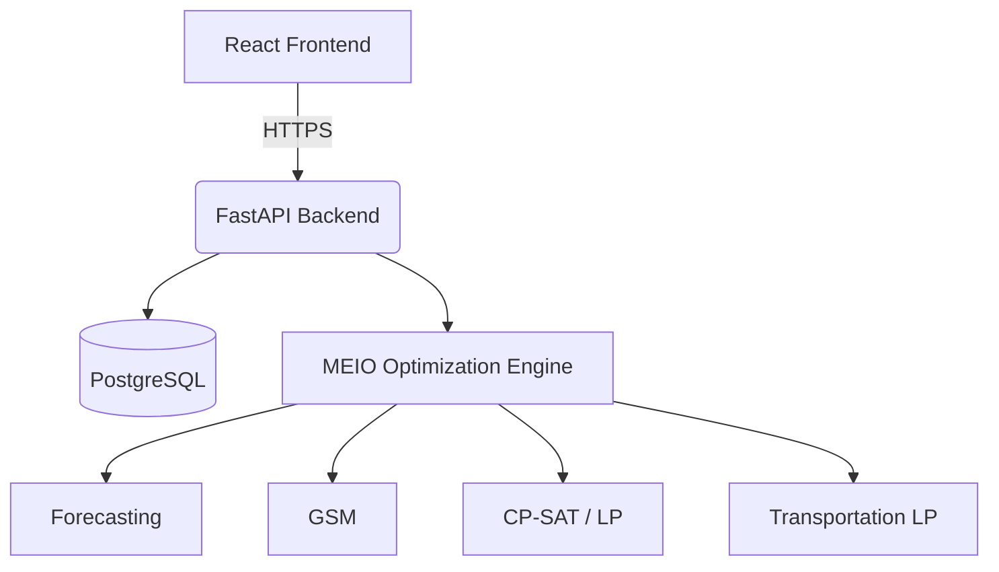

# MEIO Platform

Multi-Echelon Inventory Optimization (MEIO) Platform.

## Architecture

## Tech Stack
- **Frontend**: React (Vite, TypeScript)
- **Backend**: FastAPI (Python)
- **Database**: PostgreSQL
- **Optimization**: OR-Tools (CP-SAT/LP), custom modules
- **Infrastructure**: Docker, GitHub Actions

## Repository Structure
- `backend/`: FastAPI application, optimization engine, database migrations (Alembic)
- `frontend/`: React application
- `database/`: Database seed scripts and migrations
- `scripts/`: Data generation and pipeline execution scripts
- `.github/`: CI/CD workflows and issue templates

## Local Setup
1. Clone the repository: `git clone <repo> && cd meio-platform`
2. Set environment variables: `cp .env.example .env`
3. Start infrastructure: `make docker-up`
4. Run migrations: `make migrate`
5. Generate data & seed: `make generate-data && make seed`
6. Run tests: `make test`
7. Start dev servers (if not using docker for apps): `make dev`

Access the apps:
- Frontend: http://localhost:5173
- Backend: http://localhost:8000
- API Docs: http://localhost:8000/docs

## Environment Variables
See `.env.example`. Never commit `.env` or any secrets.

## Git Workflow
We use a feature branch workflow:
1. `main`: stable, demo-ready
2. `develop`: integration branch
3. `feature/*`: individual development
4. `fix/*`: bug fixes

Use conventional commits: `feat:`, `fix:`, `refactor:`, `test:`, `docs:`, `chore:`, `ci:`.

## CI/CD
GitHub Actions run on every push to `develop` and `main`, as well as on PRs.
- `backend-ci.yml`: Python linting, typing, and tests.
- `frontend-ci.yml`: Node linting, typing, and build.
- `deploy.yml`: Staging deployment from `develop`, production from `main`.

## MEIO Pipeline
The pipeline runs daily and executes:
1. Data Validation
2. Demand Classification & Forecast
3. GSM Optimization (Safety Stock, ROP, Order Quantity)
4. Transportation Optimization
5. Alerts Generation

## Team Responsibilities
- [Name 1]: [Roles/Responsibilities]
- [Name 2]: [Roles/Responsibilities]
